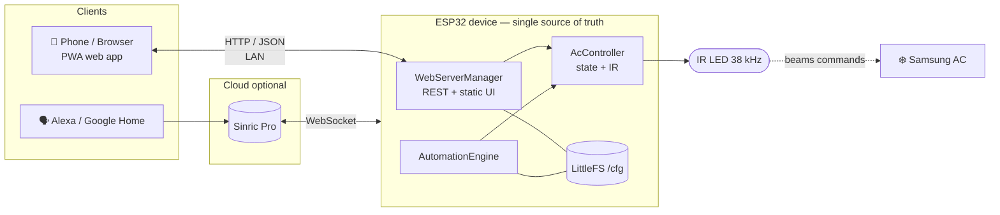
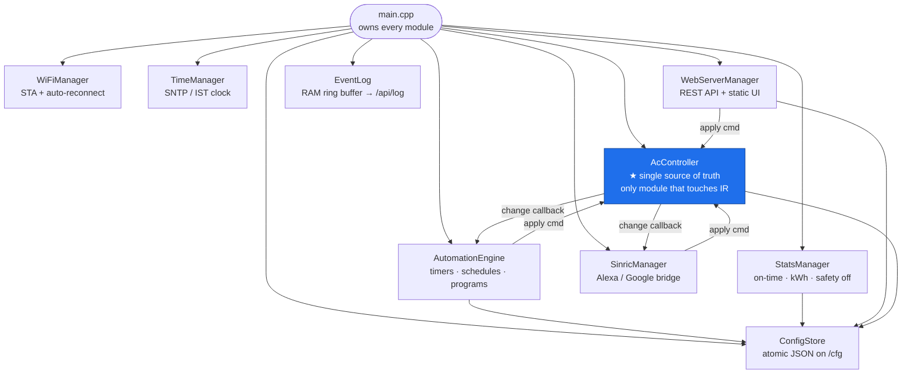
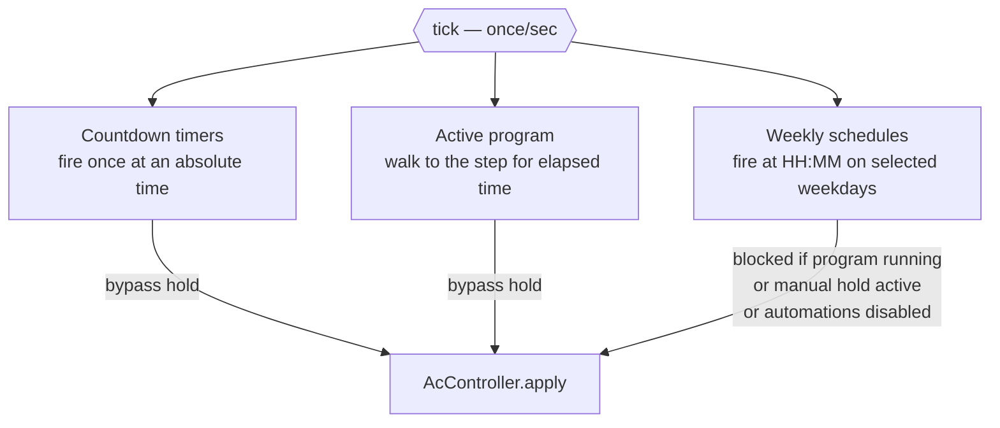
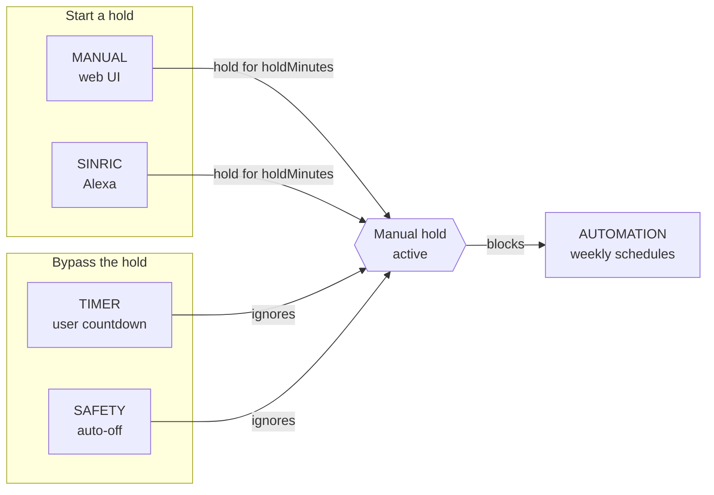

# ESP32 AC Controller

> Wi‑Fi remote, scheduler, and energy monitor for a Samsung split AC — built on a
> single ESP32 with an IR LED. Serves its own mobile web app (installable as a
> PWA) from on‑board flash, bridges to Alexa / Google Home through Sinric Pro,
> and runs all clock‑based automation **on the device** — no cloud, no hub, no
> app‑store dependency.

<p align="center">
  
  
  
  
  
</p>

---

## Table of contents

- [What it does](#what-it-does)
- [How it all fits together](#how-it-all-fits-together)
- [Hardware](#hardware)
- [Getting started](#getting-started)
- [Runtime architecture](#runtime-architecture)
- [Anatomy of a command](#anatomy-of-a-command)
- [The automation engine](#the-automation-engine)
- [Command precedence — "manual wins"](#command-precedence--manual-wins)
- [Energy & cost model](#energy--cost-model)
- [Persistence & memory layout](#persistence--memory-layout)
- [The web app (frontend & PWA)](#the-web-app-frontend--pwa)
- [Cloud bridge (Alexa / Google Home)](#cloud-bridge-alexa--google-home)
- [REST API reference](#rest-api-reference)
- [Project layout](#project-layout)
- [Build system](#build-system)
- [Troubleshooting](#troubleshooting)
- [Design decisions & rationale](#design-decisions--rationale)

---

## What it does

| Capability | Description |
|------------|-------------|
| **Web UI** | Mobile‑first control panel served from flash. Power / temperature / mode / fan, plus one‑tap presets ("scenes"). Installable to the home screen as a PWA that works offline. |
| **Automations** | Three complementary types — **countdown timers**, **weekly schedules**, and multi‑step **programs** (e.g. *"on 60 m @ 24°, then 25°, then 26°, then off"* — sleep curves and interval cycling). |
| **Live 24‑hour timeline** | The UI projects the next 24 h of schedules, timers, and the running program client‑side, showing exactly when the AC will switch and what it will cost. |
| **Energy stats** | Daily commanded on‑time for the last 30 days with kWh / cost estimates for today, the last 7 days, and the month. |
| **Filter reminder** | Counts total on‑hours and nags after a configurable threshold. |
| **Safety auto‑off** | Optional cut‑off after N continuous on‑hours. |
| **Event log** | In‑RAM ring buffer of every command and automation decision — including *skipped* ones and *why*. |
| **Voice / cloud** | Optional Sinric Pro bridge → Alexa, Google Home, and the Sinric app. |
| **Resilience** | State, schedules, programs, presets, and stats persist to LittleFS; programs resume after a reboot; optional restore‑after‑power‑cut. |

---

## How it all fits together

The device is the only thing that must always be running. Everything else — your
phone, Alexa, the router — is optional and can come and go.



**Key idea:** the AC is *write‑only*. IR is one‑directional, so the ESP32 never
knows the AC's real state — it only knows what it **last told** the AC. Every
"is the AC on?" answer in this project means *"is the AC on, as far as our last
command is concerned?"* This one fact shapes the whole design (see
[Energy & cost model](#energy--cost-model)).

---

## Hardware

| Part | Notes |
|------|-------|
| **ESP32 dev board** | `esp32dev` PlatformIO target (any generic ESP32‑WROOM works) |
| **IR LED** + NPN transistor driver | Data on **GPIO 4**, 38 kHz carrier. A bare GPIO can't drive an IR LED far — use a transistor (e.g. 2N2222) + current‑limiting resistor for whole‑room range. |
| **Samsung split AC** | Protocol handled by IRremoteESP8266's `IRSamsungAc`. Other brands would only need a different `ir_*` driver in `AcController`. |

```
ESP32 GPIO4 ──[ 220Ω ]──> Base
                          NPN (2N2222)
   Collector ──[ IR LED ]──┐
                           │
   Emitter ────────────────┴──── GND     (LED anode → 5V/3V3 through LED)
```

Point the LED at the AC's IR receiver. Because IR is line‑of‑sight, mount the
ESP32 where a normal remote would work.

---

## Getting started

### 1. Credentials

```sh
cp include/secrets.h.example include/secrets.h
```

Fill in your Wi‑Fi SSID/password. Sinric keys are optional — **leave them as
empty strings (`""`) to disable cloud control** and the firmware builds and runs
without an account.

```c
#define WIFI_SSID       "your-wifi"
#define WIFI_PASSWORD   "your-password"
#define SINRIC_APP_KEY       ""   // optional
#define SINRIC_APP_SECRET    ""   // optional
#define SINRIC_AC_DEVICE_ID  ""   // optional
```

### 2. Flash firmware **and** filesystem

The web UI lives in a separate LittleFS image that must be uploaded once (and
again whenever you change anything in `data/`):

```sh
pio run -t upload      # compile + flash firmware
pio run -t uploadfs    # build LittleFS image from data/ and flash it
```

> PlatformIO not on your PATH? Use the bundled binary:
> `$USERPROFILE/.platformio/penv/Scripts/pio.exe`

### 3. Find the device

```sh
pio device monitor     # 115200 baud — prints the assigned IP on boot
```

The UI is then reachable by name from any client on the LAN:

| URL | Works on |
|-----|----------|
| `http://ac-controller/` | Windows (NetBIOS/NBNS) |
| `http://ac-controller.local/` | Android / iOS / macOS / Linux (mDNS) |
| `http://<device-ip>/` | Everything, always — the guaranteed fallback |

---

## Runtime architecture

Everything is composed as **single‑owner modules** wired together in
[`src/main.cpp`](src/main.cpp). There is no service locator and no globals
beyond the module instances themselves — dependencies are passed by reference in
constructors, which makes the ownership graph explicit and testable.



### Module responsibilities

| Module | Responsibility |
|--------|----------------|
| **AcController** | The **single source of truth** for AC state and the **only** module allowed to touch the IR transmitter. Everyone requests changes via `apply()`. Enforces the manual‑hold override policy. |
| **AutomationEngine** | Evaluates timers, weekly schedules, and step programs once a second. Deterministic interaction rules (below). |
| **StatsManager** | Derives on‑time / energy / cost purely from *commanded* state; runs the filter counter and safety auto‑off. |
| **TimeManager** | SNTP time in IST. Automations block until the first sync lands. |
| **WiFiManager** | STA connection with a 5 s reconnect loop. |
| **SinricManager** | Optional cloud bridge; disables itself cleanly if credentials are empty. |
| **WebServerManager** | REST API + static frontend (ESPAsyncWebServer). Also owns presets/scenes. |
| **EventLog** | 50‑entry RAM ring buffer of commands and automation decisions. |
| **ConfigStore** | Load/save ArduinoJson docs under `/cfg/` on LittleFS. |

### The threading model — the single most important rule

The ESP32 runs **two contexts that matter here**:

```mermaid
sequenceDiagram
    participant TCP as Async TCP task<br/>(ESPAsyncWebServer / Sinric)
    participant State as Shared state<br/>(behind std::mutex)
    participant Loop as Arduino loop()<br/>(main task)
    participant HW as Hardware<br/>(IR LED, flash)

    TCP->>State: mutate state under mutex
    TCP->>State: raise dirty / sendPending flag
    Note over TCP: NEVER touches IR or flash
    Loop->>State: read flags under mutex
    Loop->>HW: 🔴 IR send (bit‑banged 38 kHz)
    Loop->>HW: 🔴 LittleFS write (persist)
```

> **HTTP handlers and cloud callbacks run in the async TCP task. They may only
> mutate in‑RAM state under a mutex and raise dirty flags. All IR sends and all
> flash writes happen exclusively in `loop()`.**

Why: the 38 kHz IR carrier is software bit‑banged with microsecond busy‑waits.
Doing that from the async task (or letting a flash write stall it) corrupts the
waveform and the AC misses the command. Deferring hardware work to `loop()`
keeps the timing‑critical section on one cooperative task.

---

## Anatomy of a command

Follow a single tap — *"turn the AC on"* — end to end:

```mermaid
sequenceDiagram
    autonumber
    participant U as 📱 User
    participant JS as script.js
    participant Web as WebServerManager<br/>(async task)
    participant Ctrl as AcController
    participant Loop as loop() (main task)
    participant IR as IR LED → AC
    participant CB as Callbacks

    U->>JS: tap Power
    JS->>Web: POST /api/power {"on":true}
    Web->>Ctrl: apply(cmd, MANUAL, "web UI")
    Note over Ctrl: check manual hold<br/>mutate state under mutex<br/>set sendPending_ / savePending_
    Ctrl-->>Web: return new state
    Web-->>JS: 200 + /api/status JSON
    JS-->>U: UI updates immediately

    loop every ~10 ms
        Loop->>Ctrl: loop()
        Ctrl->>IR: 🔴 transmit() if sendPending_
        Ctrl->>CB: fire change callbacks
        CB->>CB: automation.onExternalCommand() → cancels program
        CB->>CB: sinric.pushState() → mirror to cloud
        Ctrl->>Ctrl: persistState() if savePending_
    end
```

The HTTP response returns **before** the IR is actually sent — the UI is
optimistic, and the physical send follows a few milliseconds later in `loop()`.
Because `apply()` mutated state synchronously, the `/api/status` reply already
reflects the new state.

---

## The automation engine

Three automation types share one engine, evaluated once per second. All are
**partial commands** (`AcCommand`) — a schedule can say *"on at 24° cool"* while
a plain off‑timer touches only power.



| Type | Shape | Example | Limits |
|------|-------|---------|--------|
| **Countdown timer** | Fire one action after *N* minutes | "off in 45 min" | 10 timers |
| **Weekly schedule** | Fire at `HH:MM` on a weekday bitmask | "on 24° cool at 22:00 Mon–Fri" | 16 slots |
| **Program** | Ordered list of steps (`on` for *N* min at temp/mode/fan, or `off`), optional repeat + end time | Sleep curve: "60 m @24 → 60 m @25 → 120 m @26 → off" | 10 programs × 20 steps |

**Deterministic interaction rules** (chosen so behaviour is always predictable):

- Weekly schedules are **skipped** while a program is running, while a manual
  hold is active, or when automations are disabled — and every skip is *logged*
  with its reason.
- Any `MANUAL` / `SINRIC` / `TIMER` / `SAFETY` command **cancels a running
  program**.
- Programs and timers **bypass** the manual hold. (A program can only be running
  if no hold is active — starting one clears it.)
- Programs **resume after a reboot**: the engine persists the active program's
  id and start time, and on boot re‑derives which step should be current.

---

## Command precedence — "manual wins"

Every state change carries a `CmdSource`. The precedence rules live in
`AcController` and key entirely off this enum:



| Source | Effect |
|--------|--------|
| `MANUAL` (web) / `SINRIC` (cloud) | Starts a **hold** of `holdMinutes` (default 120) during which weekly schedules are rejected. Rationale: if you reach for the phone or ask Alexa, you mean it — don't let a schedule stomp you 5 minutes later. |
| `TIMER` (your countdown) | Bypasses the hold — you set it deliberately. |
| `SAFETY` (auto‑off) | Bypasses the hold — protective, always allowed. |
| `AUTOMATION` (schedule) | Lowest priority; blocked by an active hold. |
| `BOOT` | State restore on power‑up (if `restoreOnBoot`). |
| `SYSTEM` | Non‑command log entries (NTP sync, boot). |

You can end a hold early from the UI (or `POST /api/override/clear`).

---

## Energy & cost model

Because IR is one‑way, the device tracks **commanded on‑time**, not real
compressor duty cycle. The estimate is intentionally simple and transparent:

```
energy (kWh) = on-time (hours) × acWatts / 1000
cost         = energy (kWh)    × tariffPerKwh   (₹/kWh)
```

- `acWatts` (default **1560 W**) and `tariffPerKwh` (default **₹8.0**) are set in
  Settings.
- `StatsManager` accumulates per‑day on‑seconds (30‑day rolling window) and the
  API exposes today / 7‑day / 30‑day rollups.
- The UI's 24‑hour **timeline** applies the *same* formula forward over your
  configured schedules, timers, and running program to project upcoming cost —
  the firmware's automation rules are mirrored in client‑side JS so the
  projection matches what the device will actually do.

> This is an *estimate of what you asked the AC to do*, useful for relative
> comparisons and trend‑spotting — not a revenue‑grade meter.

---

## Persistence & memory layout

### Config files (LittleFS `/cfg/`)

`ConfigStore` reads/writes ArduinoJson documents. Each module keeps its own
dirty flag and calls `save()` from `loop()` (never from the async task).

| File | Written by | Contents |
|------|-----------|----------|
| `/cfg/settings.json` | WebServerManager | hold minutes, watts, tariff, filter limit, safety, toggles |
| `/cfg/schedules.json` | AutomationEngine | weekly schedule slots |
| `/cfg/programs.json` | AutomationEngine | program definitions |
| `/cfg/runtime.json` | AutomationEngine | active program id + start (for resume) |
| `/cfg/state.json` | AcController | last AC state (for `restoreOnBoot`) |
| `/cfg/stats.json` | StatsManager | 30‑day on‑time history + filter counter |
| `/cfg/presets.json` | WebServerManager | named scenes |

### Flash partition table

The stock `min_spiffs` layout reserves two 1.9 MB OTA app slots (this project
doesn't use OTA) and leaves only ~128 KB of filesystem — which the web UI fills
completely, crashing littlefs on the first `mkdir`. The custom
[`partitions.csv`](partitions.csv) uses a single app slot instead:

| Partition | Size | Purpose |
|-----------|------|---------|
| `nvs` | 20 KB | Non‑volatile store (Wi‑Fi calibration, etc.) |
| `app0` (factory) | **2.5 MB** | The firmware |
| `spiffs` (LittleFS) | **~1.4 MB** | Web UI **+** all `/cfg` config/state/stats |

The [`mountFileSystem()`](src/main.cpp) routine also **self‑heals** a
zero‑capacity volume: a freshly erased flash can mount "successfully" with a
block count of 0, and the first write then divides by zero deep inside littlefs
and boot‑loops the CPU. So an empty mount is treated as failure and forced
through one clean reformat; if even that fails, the device runs without
persistence rather than bricking.

---

## The web app (frontend & PWA)

The UI in [`data/`](data/) is **dependency‑free vanilla JS** — no framework, no
build step for the JS itself, no npm.

| File | Role |
|------|------|
| `index.html` | App shell / markup |
| `style.css` | Dark, mobile‑first styling |
| `script.js` | All logic: polling `/api/status`, control handlers, the 24 h timeline, stats, schedule/program editors |
| `manifest.json` | PWA manifest — installs "AC Control" to the home screen, standalone/portrait |
| `sw.js` | Service worker — caches the app shell for offline/instant open; **never** caches `/api/*` (device data must be live) |
| `icons/` | App + maskable + Apple touch icons |

**Serving:** at build time, `tools/gzip_data.py` pre‑compresses the text assets;
`WebServerManager` serves the `.gz` siblings with `Content-Encoding: gzip`
(`.setTryGzipFirst(true)`), so the ESP32 ships ~4× smaller payloads without
compressing on the fly.

**Offline model:** the service worker caches the shell (HTML/CSS/JS/icons) under
a versioned cache (`ac-control-v2`) so the app opens instantly and works with no
network; live device state always falls through to the network. Bump the `CACHE`
constant in `sw.js` when the shell changes to evict the old copy.

---

## Cloud bridge (Alexa / Google Home)

`SinricManager` connects to **Sinric Pro** as a `WindowAC` device over a
WebSocket, mapping:

| AC feature | Sinric capability |
|------------|-------------------|
| Power | On/Off |
| Temperature | Target temperature |
| Mode | Thermostat mode (COOL / HEAT / AUTO) |
| Fan | Range value 1–3 (low/med/high) |

Traffic is **bidirectional**:

- **Cloud → device:** Sinric callbacks run inside `SinricPro.handle()` (called
  from the main loop), so they can safely call `AcController::apply()` with
  source `SINRIC`.
- **Device → cloud:** every local/automation change fires the AcController
  change callback, which calls `sinric.pushState()` to mirror state back so the
  Alexa app stays in sync. `SINRIC` is kept distinct from `MANUAL` precisely so
  the bridge can skip echoing its own commands back to the cloud.

Leaving the Sinric keys empty in `secrets.h` disables the whole module — no
account required.

---

## REST API reference

All bodies are JSON. An `action` object is a **partial** AC state: any of
`power`, `temp`, `mode`, `fan`.

### Control

| Endpoint | Method | Body |
|----------|--------|------|
| `/api/status` | GET | — → full state + time + hold + program + next schedule |
| `/api/power` | POST | `{"on": true}` |
| `/api/temp` | POST | `{"value": 16-30}` |
| `/api/mode` | POST | `{"mode": "cool\|dry\|fan\|auto\|heat"}` |
| `/api/fan` | POST | `{"speed": "auto\|low\|medium\|high"}` |

### Presets (scenes)

| Endpoint | Method | Body |
|----------|--------|------|
| `/api/presets` | GET / POST | named one‑tap states |
| `/api/presets/apply` | POST | apply a named preset |

### Automation

| Endpoint | Method | Body |
|----------|--------|------|
| `/api/timers` | GET / POST | `{"minutes": n, "action": {…}}` |
| `/api/timers/cancel` | POST | `{"id": n}` (`-1` = all) |
| `/api/schedules` | GET / POST | `{"slots": [{name, enabled, days:[0-6], time:"HH:MM", action}]}` |
| `/api/programs` | GET / POST | `{"programs": [{id, name, repeat, endTime, steps[]}]}` |
| `/api/program/start` | POST | `{"id": "...", "endTime": "HH:MM"?}` |
| `/api/program/stop` | POST | — |

### Monitoring & settings

| Endpoint | Method | Body |
|----------|--------|------|
| `/api/stats` | GET | today / week / month cost + 30‑day history + filter |
| `/api/settings` | GET / POST | hold, watts, tariff, filter limit, safety, toggles |
| `/api/log` | GET | recent events, newest first |
| `/api/filter/reset` | POST | reset the filter‑hours counter |
| `/api/override/clear` | POST | end the manual hold early |

<details>
<summary><strong>Example <code>/api/status</code> response</strong></summary>

```json
{
  "power": true,
  "mode": "cool",
  "temp": 24,
  "fan": "auto",
  "timeValid": true,
  "time": "2026-07-11 22:14",
  "epoch": 1799999999,
  "override": { "active": true, "until": 1800007199 },
  "automationEnabled": true,
  "program": { "...": "active program summary, if any" },
  "nextSchedule": { "...": "name + fire time of the next slot" }
}
```
</details>

---

## Project layout

```
esp32-ac-controller/
├── platformio.ini          # board, libs, filesystem, build hooks
├── partitions.csv          # custom 2.5 MB app / 1.4 MB FS layout
├── include/
│   ├── ACState.h           # protocol-agnostic AC state + enums
│   ├── AcCommand.h         # partial command + JSON (de)serialization + CmdSource
│   ├── AppSettings.h       # user-tunable settings struct
│   └── secrets.h(.example) # Wi-Fi + Sinric credentials (gitignored)
├── src/
│   ├── main.cpp            # composition root, setup()/loop(), FS mount, name services
│   ├── AcController.*      # ★ state + IR + override policy
│   ├── AutomationEngine.*  # timers, schedules, programs
│   ├── StatsManager.*      # on-time, energy, filter, safety
│   ├── TimeManager.*       # SNTP / IST clock
│   ├── WiFiManager.*       # STA + reconnect
│   ├── SinricManager.*     # Alexa / Google bridge
│   ├── WebServerManager.*  # REST API + static UI + presets
│   ├── EventLog.*          # RAM ring buffer
│   └── ConfigStore.*       # JSON persistence on /cfg
├── data/                   # web app → LittleFS (uploadfs)
│   ├── index.html · style.css · script.js
│   ├── manifest.json · sw.js · icons/
│   └── *.gz                # build artifacts (gitignored)
└── tools/
    └── gzip_data.py        # pre-build asset compression
```

---

## Build system

- **PlatformIO / Arduino framework**, board `esp32dev`.
- **Libraries** (`platformio.ini`): `IRremoteESP8266` (Samsung IR),
  `ESPAsyncWebServer` + `AsyncTCP` (non‑blocking HTTP), `ArduinoJson` (all
  serialization), `SinricPro` (cloud bridge).
- **Filesystem:** LittleFS with the custom partition table.
- **Pre‑build hook:** `extra_scripts = pre:tools/gzip_data.py` gzips `data/*`
  before the FS image is packaged.
- **Serial:** 115200 baud, with `esp32_exception_decoder` so panic backtraces
  decode to `file:line` in the monitor.

Two upload targets, remember both:

```sh
pio run -t upload      # firmware  (changes to src/, include/)
pio run -t uploadfs    # web UI    (changes to data/)
```

---

## Troubleshooting

**Can't open the UI from a Windows PC (but it works on the phone)**
Windows resolves `.local` (mDNS) unreliably. In order of preference:
1. Use `http://ac-controller/` — served via NetBIOS, which Windows always understands.
2. Use the raw IP from the serial console. Add a DHCP reservation in your router so it never moves.
3. Still nothing? Confirm the PC is on the *same* network (not a guest SSID with client isolation) and the network profile is **Private** — Windows firewalls treat *Public* networks aggressively.

**Automations don't fire**
Check the status strip in the UI. Likely causes: the clock hasn't synced yet
(automations block until the first SNTP sync), a **manual hold** is active
(manual/Alexa commands pause schedules for `holdMinutes`), or automations are
disabled in Settings. The event log (`/api/log`) records *skipped* schedules and
why.

**`vfs_api.cpp: … does not exist, no permits for creation` at boot**
Harmless first‑boot noise from older firmware trying to `open()` config files
that don't exist yet. Current firmware checks existence first; configs are
created on first save.

**The AC ignores commands**
IR is line‑of‑sight and needs range. Confirm the LED points at the AC's
receiver, and drive it through a transistor rather than straight off the GPIO.

---

## Design decisions & rationale

- **One source of truth, one IR owner.** Only `AcController` mutates state or
  touches the IR pin. This removes an entire class of race conditions and makes
  "who changed the AC and why" answerable from a single place.
- **Defer all hardware work to `loop()`.** Async handlers only touch RAM under a
  mutex and raise flags. Timing‑critical IR and slow flash writes never run on
  the async task, so the 38 kHz waveform is never corrupted.
- **Protocol‑agnostic state.** `ACState` has no IRremoteESP8266 dependency, so a
  future MQTT/Home Assistant/other‑brand path can reuse it without dragging in
  IR headers.
- **Partial commands.** `AcCommand` carries only the fields it wants to change,
  which lets schedules, timers, and programs express intent precisely (e.g. an
  off‑timer that leaves temp/mode untouched).
- **Deterministic automation.** Every conflict (manual vs schedule, program vs
  schedule) has one defined outcome, and every skipped action is logged with a
  reason — no guessing why the AC did or didn't switch.
- **Graceful degradation everywhere.** No Sinric keys → no cloud module. Bad
  flash volume → run without persistence instead of bricking. No clock yet →
  automations wait instead of firing at the wrong time.
```
